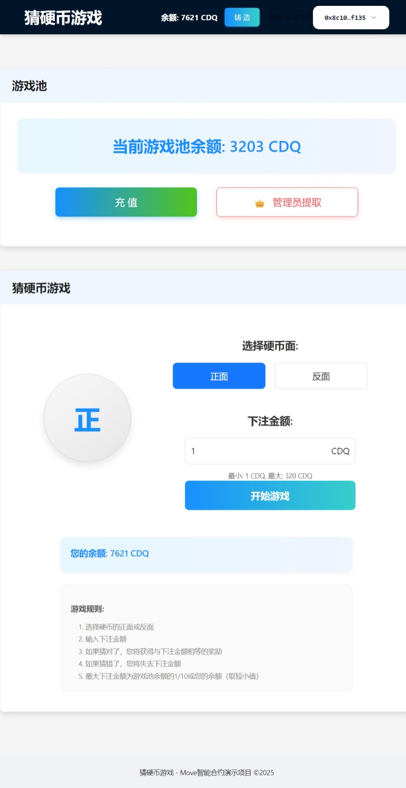

# 猜硬币游戏 - Sui区块链应用

这是一个基于Sui区块链的猜硬币游戏完整应用，包含智能合约和前端界面。用户可以猜测硬币的正面或反面，并下注代币。如果猜对了，用户将获得与下注金额相等的奖励；如果猜错了，用户将失去下注金额。


## 项目结构

本项目包含以下主要组件：

- `move_game/` - 游戏智能合约和前端应用
  - `sources/` - Move语言编写的智能合约源代码
  - `frontend/` - React前端应用
  - `build/` - 编译后的智能合约
  - `tests/` - 合约测试文件
  
- `faucet_coin/` - 游戏代币智能合约
  - `sources/` - 代币合约源代码
  - `build/` - 编译后的代币合约

## 快速开始

### 部署智能合约

1. 安装Sui CLI工具
2. 编译并部署代币合约：
```
cd faucet_coin
sui move build
sui client publish --gas-budget 10000000
```

3. 编译并部署游戏合约：
```
cd move_game
sui move build
sui client publish --gas-budget 10000000
```

4. 记录部署后获得的合约地址和对象ID，并更新前端配置。

### 启动前端应用

1. 配置前端：
```
cd move_game/frontend
```

2. 编辑 `src/config.ts` 文件，更新合约地址和对象ID。

3. 安装依赖并启动应用：
```
npm install
npm start
```

详细说明请参阅 [前端README文件](move_game/frontend/README.md)。

## 功能特性

- 基于Move语言的安全智能合约
- 自定义游戏代币
- 随机数生成机制
- 游戏池资金管理
- 管理员权限控制
- 响应式前端界面

## 技术栈

- Move语言 (Sui区块链)
- React
- TypeScript
- Ant Design
- Sui SDK

## 许可证

[MIT](LICENSE)

## 联系方式

如有问题或建议，请联系项目维护者。 